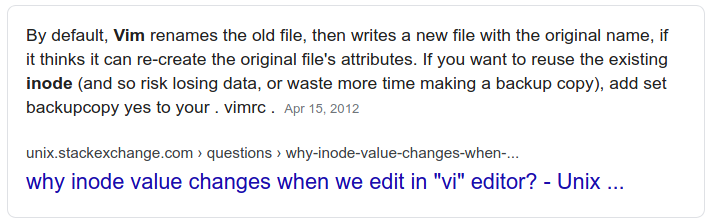

1.g Create and edit text files
===

## Editing files

You should be familiar with at least one of the editors below:
- vi (1p)              - screen-oriented (visual) display editor
- vim (1)              - Vi IMproved, a programmer's text editor
- nano (1)             - Nano's ANOther editor, an enhanced free Pico clone
- emacs                - GNU Emacs text editor

**📝 NOTE:** _Be aware that `vim` changes files by copying the file over (so the inode also changes)._

## Viewing files

**Review the following commands:**
- cat (1)              - concatenate files and print on the standard output
- less (1)             - opposite of more
- more (1p)            - display files on a page-by-page basis
- head (1)             - output the first part of files
- tail (1)             - output the last part of files

## Text Manipulation

**Review the following commands:**
- sort (1)             - sort lines of text files
- wc (1p)              - word, line, and byte or character count
- grep (1)             - print lines matching a pattern
- sed (1)              - stream editor for filtering and transforming text
- uniq (1)             - report or omit repeated lines
- diff (1)             - compare files line by line
- paste (1)            - merge lines of files

---
[⬅️ Back](1-Understand-and-use-essential-tools.md)
