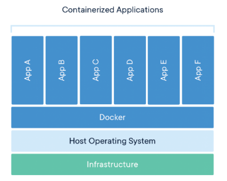

# 10.a Find and retrieve container images from a remote registry

## What is a Container

A container is a standard unit of software that packages up code and all its dependencies so the application runs quickly and reliably from one computing environment to another.  

There are several competing Container Image formats (Docker, Appc, LXD), but the industry is moving forward with a standard governed under the Open Container Initiative – sometimes referred to simply as Open Containers or the OCI.

### Image vs Container

Images can exist without containers, whereas a container needs to run an image to exist. Therefore, containers are dependent on images and use them to construct a run-time environment and run an application.

### Docker

> Docker is a containerization stage where we can bundle our application with its libraries and conditions inside that container. Docker Container is a to some degree like a virtual machine.

A Docker container image is a lightweight, standalone, executable package of software that includes everything needed to run an application: code, runtime, system tools, system libraries and settings.

Container images become containers at runtime and in the case of Docker containers - images become containers when they run on Docker Engine. Available for both Linux and Windows-based applications, containerized software will always run the same, regardless of the infrastructure. Containers isolate software from its environment and ensure that it works uniformly despite differences for instance between development and staging.

#### Docker Engine

Docker Engine is the industry’s de facto container runtime that runs on various Linux (CentOS, Debian, Fedora, Oracle Linux, RHEL, SUSE, and Ubuntu) and Windows Server operating systems.  

### Podman

Podman is a daemon-less container engine for developing, managing, and running OCI Containers on your Linux System. Containers can either be run as root or in rootless mode.

Podman is a daemonless, open source, Linux native tool designed to make it easy to find, run, build, share and deploy applications using Open Containers Initiative (OCI) Containers and Container Images. Podman provides a command line interface (CLI) familiar to anyone who has used the Docker Container Engine. Most users can simply alias Docker to Podman (alias docker=podman) without any problems.

Similar to other common Container Engines (Docker, CRI-O, containerd), Podman relies on an OCI compliant Container Runtime (runc, crun, runv, etc) to interface with the operating system and create the running containers. This makes the running containers created by Podman nearly indistinguishable from those created by any other common container engine.

### Docker vs Podman

- **Podman**  
  - Does not use a daemon to develop, manage and run OCI containers, it must run on top of a Linux OS
  - Containers can either be run as root or in rootless mode
  - Commands are the same as docker-cli
  - Can use the docker registry
- **Docker**  
  - Utilizes a daemon, which is a persistent background process that handles all container management duties on the host
  - Can be run on Windows (however images are not interchangeable with Linux images

### Rootless Containers

You can run containers as 'root' or as the unprivileged users (rootless container). Running as an unprivileged user is more secure but it has some restrictions (like not having access to privileged ports).  

### Container Registries

A container registry is a repository for storing container images. A container image consists of many files, which encapsulate an application. After a host/developer puts an image into a registry, other hosts/users can download it . This allows the same application to be shipped from a host to another.

Registries can be public or private (like for a corporate environment). And registries can have different rules in regards to how the image should be build.  

Red Hat provides two container registries to distribute certified container images (you can access with your Red Hat log in credentials):
+ registry.redhat.io for containers based on official Red Hat products.
+ registry.connect.redhat.com for containers based on third-party products.  

You can search the Red Hat images with the `podman` command, or even via a browser:

https://catalog.redhat.com/software/containers/

## Getting Started

Make sure that the 'podman' package is installed.  

Display a help for podman

    # podman help

Optionally you can install the 'container-tools' module which will install several container related tools

    # dnf module install container-tools

**📌 EXAM TIP:** _If you are familiar with docker cli, because the commands are the same, you can create an alias for docker and use the bash complete for podman (as below)._

    alias docker='podman'
    complete -F _cli_bash_autocomplete podman

### Configuration

The default system configuration files can exist in either `/etc/containers/containers.conf` or `/usr/share/containers/containers.conf`.  

User configuration is saved at `$HOME/.config/containers` directory. And configuration in this file override the system-wide settings.

Note container engines also use other configuration files for configuring the environment:
- `storage.conf` for configuration of container and images storage.
- `registries.conf` for definition of container registires to search while pulling container images.
- `policy.conf` for controlling which images can be pulled to the system.

#### Registry

Registry configuration for podman is saved at `/etc/containers/registries.conf`.

    # cat /etc/containers/registries.conf
    # This is a system-wide configuration file used to
    # keep track of registries for various container backends.
    # It adheres to TOML format and does not support recursive
    # lists of registries.
    # The default location for this configuration file is /etc/containers/registries.conf.
    # The only valid categories are: 'registries.search', 'registries.insecure',
    # and 'registries.block'.
    [registries.search]
    registries = ['registry.redhat.io', 'quay.io', 'docker.io']
    # If you need to access insecure registries, add the registry's fully-qualified name.
    # An insecure registry is one that does not have a valid SSL certificate or only does HTTP.
    [registries.insecure]
    registries = []
    # If you need to block pull access from a registry, uncomment the section below
    # and add the registries fully-qualified name.
    #
    [registries.block]
    registries = []

You can also use the `podman system` commands to get information on a system
- podman-system-info (1) - Displays Podman related system information
- podman-system-df (1) - Show podman disk usage

## Find and Retrieve Containers

**Commands:**
- podman-search (1)    - Search a registry for an image                                                    
- podman-pull (1)      - Pull an image from a registry  

### Finding Images

Use 'search' to search for images

    # podman search
    INDEX        NAME        DESCRIPTION         STARS   OFFICIAL   AUTOMATED
      |            |              |                |        |           |-> "[OK]" if image is automated
      |            |              |                |        |-> "[OK]" if image is official
      |            |              |                |-> Star count of image
      |            |              |-> Image description
      |            |-> Image name
      |-> Registry

You can also filter the result (shows httpd images that have start of 5 and above)

    # podman search -f stars=5 httpd
    INDEX       NAME                                DESCRIPTION                                       STARS   OFFICIAL   AUTOMATED
    docker.io   docker.io/library/httpd             The Apache HTTP Server Project                    3269    [OK]        
    docker.io   docker.io/centos/httpd-24-centos7   Platform for running Apache httpd 2.4 or bui...   36                  
    docker.io   docker.io/centos/httpd                                                                33                 [OK]
    docker.io   docker.io/arm32v7/httpd             The Apache HTTP Server Project                    9                   
    docker.io   docker.io/arm64v8/httpd             The Apache HTTP Server Project                    6  

### Installing Images

Find the image name

    # podman search squid -f stars=5
    INDEX       NAME                                       DESCRIPTION                                       STARS   OFFICIAL   AUTOMATED
    docker.io   docker.io/lucacri/squid-ext-conf           Squid server on alpine, gathering configurat...   10                  
    docker.io   docker.io/squidex/squidex                  Squidex Headless CMS                              8                   
    docker.io   docker.io/minimum2scp/squid                squid3 cache service container running on de...   55                 [OK]
    docker.io   docker.io/b4tman/squid                     Squid container based on Alpine Linux             11                 [OK]
    docker.io   docker.io/sameersbn/squid                                                                    205                [OK]
    docker.io   docker.io/jacobalberty/squid               A simple SSL bump capable squid image built ...   7                  [OK]
    docker.io   docker.io/datadog/squid                    Squid proxy configurable container.               36                  
    docker.io   docker.io/squidfunk/mkdocs-material        A Material Design theme for MkDocs                75                 [OK]
    docker.io   docker.io/malaohu/squid-with-net-speeder   auto build squid proxy                            15                 [OK]
    docker.io   docker.io/jpetazzo/squid-in-a-can                                                            31                 [OK]

Install it with 'podman pull'

    # podman pull docker.io/sameersbn/squid
    Trying to pull docker.io/sameersbn/squid...
    Getting image source signatures
    Copying blob a31c3b1caad4 done   
    Copying blob 5b7339215d1d done   
    Copying blob 14ca88e9f672 done   
    Copying blob cdc767309668 done   
    Copying blob cdc767309668 skipped: already exists   
    Copying blob b054a26005b7 done   
    Copying blob fbd167be87d1 done   
    Copying config a68a19f689 done   
    Writing manifest to image destination
    Storing signatures
    a68a19f689c33fb5cdeeafbd217d4a3966892d9e2c45286e0413e0de8901ed5c

You can also download and run the image at the same time

    [root@localhost ~]# docker run -it registry.access.redhat.com/ubi8/ubi
    Trying to pull registry.access.redhat.com/ubi8/ubi...
    Getting image source signatures
    Copying blob 1b8dabac56ed done   
    Copying blob 6500ac87b29f done   
    Copying config 33df2983b0 done   
    Writing manifest to image destination
    Storing signatures
    [root@1fd9fa1e142b /]#

💡 The `run` option will download the latest version of the specified image if it does not exist in the system

---
[⬅️ Back](10-manage-containers.md)
