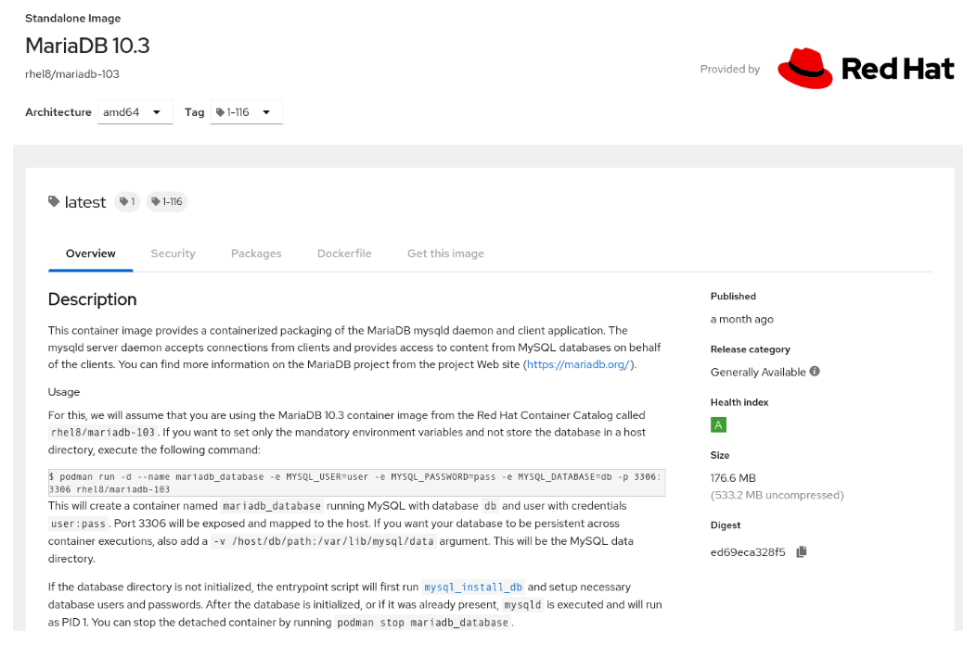
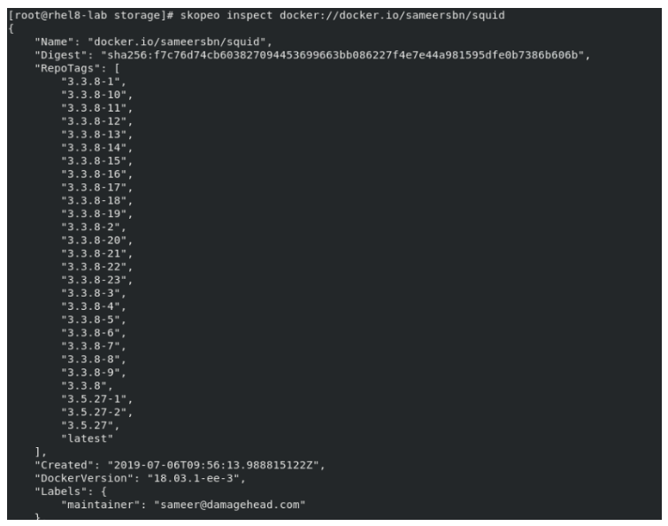

# 10.b Inspect container images

## Inspecting Containers

Inspecting containers is an important part of working with containers as it allows to understand a little more about how a container was built, it's capabilities and much more.  

For example, for the 'rhel8/mariadb-103' we can see the:

- Architecture
  - "x86_64"
- Usage - shows common usage, as well as ports and what variables can be passed to the container
  - "podman run -d -e MYSQL_USER=user -e MYSQL_PASSWORD=pass -e MYSQL_DATABASE=db -p 3306:3306 rhel8/mariadb-103"
- Url - page in the Red Hat Container Catalog that documents environment variables, security information, packages that the image includes, the Dockerfile to build the image and other info
  - "https://access.redhat.com/containers/#/registry.access.redhat.com/rhel8/mariadb-103/images/1-116"

## Inspecting local images

[RHEL > 8 > Building, running, and managing containers > Chapter 2. Working with container images > 2.10. Inspecting local images](https://access.redhat.com/documentation/en-us/red_hat_enterprise_linux/8/html/building_running_and_managing_containers/working-with-container-images_building-running-and-managing-containers#inspecting-local-images_building-running-and-managing-containers)

After you pull an image to your local system and before you run it, it is a good idea to investigate that image.  

### Inspect

The podman inspect command displays basic information about what an image does.  

### Mounting the Image/Container

Using the podman command, mount an active container to further investigate its contents.  

    # podman mount wonderful_jackson  
    /var/lib/containers/storage/overlay/bf3ba72175111741a16fa2db7b27e2f7fbd86965cf7931568bd5b6e22e002b05/merged

### Checking the Image/Container Packages

Use the rpm command to examine the packages installed on the container’s mount point

    # podman mount wonderful_jackson  
    /var/lib/containers/storage/overlay/bf3ba72175111741a16fa2db7b27e2f7fbd86965cf7931568bd5b6e22e002b05/merged

    # rpm -qa \
    --root=/var/lib/containers/storage/overlay/bf3ba72175111741a16fa2db7b27e2f7fbd86965cf7931568bd5b6e22e002b05/merged

## Inspecting Remote Images

[RHEL > 8 > Building, running, and managing containers > Chapter 2. Working with container images > 2.11. Inspecting remote images](https://access.redhat.com/documentation/en-us/red_hat_enterprise_linux/8/html/building_running_and_managing_containers/working-with-container-images_building-running-and-managing-containers#inspecting-remote-images_building-running-and-managing-containers)

**⚠️ WARNING:** _You will need to install 'skopeo'_

**📌 EXAM TIP:** _If you can't remember what to install, remember that you need a container inspector, so 'dnf search container | grep -i inspect' will give you the package name (it's easy if you are familiar with Linux)._  

To inspect a container image before you pull it to your system, you can use the 'skopeo inspect' command. With 'skopeo inspect', you can display information about an image that resides in a remote container registry.  

The command format is very similar to 'podman inspect', however you will need to provide the registry name:

    # skopeo inspect docker://docker.io/sameersbn/squid

---
[⬅️ Back](10-manage-containers.md)
