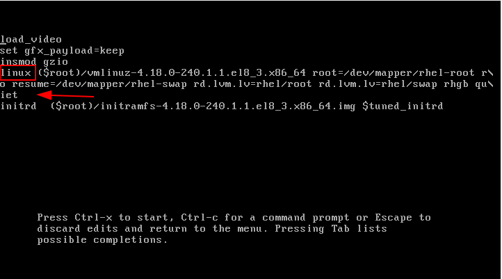

likely# 3.c Interrupt the boot process in order to gain access to a system

## Rescue Modes

As the name implies, rescue mode is there to rescue you from something. In normal operation, your Red Hat Linux system uses files located on your system's hard drive to do everything -- run programs, store your files, and more.

However, there may be times when you are unable to get Linux running completely enough to access its files on your system's hard drive. By using rescue mode, it's possible to access the files stored on your system's hard drive.

Normally, you'll need to get into rescue mode for one of two reasons:

+ You are unable to boot Linux, and you'd like to fix it.
+ You are having hardware or software problems, and you want to get a few important files off your system's hard drive.
+ To reset the 'root' user password

#### Types of rescue mode

There are different types of rescue/emergency modes:
+ **Legacy** - `rescue`, `emergency`, `rd.break`
+ **Systemd** - `emergency.target`, `rescue.target`
+ **Installation program's (Anaconda) rescue mode** - `inst.rescue`

## Getting into a Rescue Mode

At the GRUB boot menu hit 'e'

Look for the line starting with 'linux' and at the end of the line add the kernel parameter for the desired mode

Hit 'Ctrl+x' to continue

## Modes

### emergency

Emergency mode provides the most minimal environment possible and allows you to repair your system even in situations when the system is unable to enter rescue mode. In emergency mode, the system mounts the root file system only for reading, does not attempt to mount any other local file systems, does not activate network interfaces, and only starts a few essential services.

**Kernel paramenters:**
+ `emergency`
+ `systemd.unit=emergency.target`

**Description:**
+ Requires root password to enter this mode
+ Mounts the root filesystem only (RO)
+ No network
+ Only essential services are started
+ The system does not load any init scripts
+ Multi-user mode

### rescue

Equivalent to the old single user mode, where some services are started and every disk is mounted.  

Rescue mode provides a convenient single-user environment and allows you to repair your system in situations when it is unable to complete a regular booting process. In rescue mode, the system attempts to mount all local file systems and start some important system services, but it does not activate network interfaces or allow more users to be logged into the system at the same time.  

**Kernel paramenters:**
+ `rescue`
+ `systemd.unit=rescue.target`

**Description:**
+ Requires root password to enter this mode
+ Mounts all local filesystems (RW)
+ No network
+ Starts important services  
+ Single-user mode

### rd.break

Breaks to an interactive shell while in the 'initrd' allowing interaction before the system disk is mounted. The main '/' is available under '/sysroot'. Useful if you forgot root's password.

**Kernel paramenters:**
+ `rd.break`

### Recovering Root Password

[RHEL 8 > Configuring basic system settings > Chapter 9. Changing and resetting the root password > 9.3. Resetting the forgotten root password on boot](https://access.redhat.com/documentation/en-us/red_hat_enterprise_linux/8/html/configuring_basic_system_settings/changing-and-resetting-the-root-password-from-the-command-line_configuring-basic-system-settings#resetting-the-forgotten-root-password-on-boot_changing-and-resetting-the-root-password-from-the-command-line)

**Commands:**
- mount (8)            - mount a filesystem
- chroot (1)           - run command or interactive shell with special root directory
- load_policy (8)      - load a new SELinux policy into the kernel
- restorecon (8)       - restore file(s) default SELinux security contexts.

The instructions here uses `rd.break` as kernel parameter on GRUB menu, `load_policy` and `restorecon`.

a. At boot, hit `e` to edit the boot kernel parameters

b. Add `rd.break` at the end of the line that starts with linux

c. Press 'Ctrl + x' to start

d. Mount sysroot  

    switch_root:/# mount -o rw,remount /sysroot

e. Chroot into sysroot

    #switch_root:/# chroot /sysroot

f. Change the password for root

    sh-4.4# passwd

g. Load SELinux

    sh-4.4# load_policy -i

h. Fix SELinux context for `/etc/shadow`

    sh-4.4# restorecon -v /etc/shadow

i. Exit chroot

    sh-4.4# exit

j. Remount as RO

    #switch_root:/# mount -o ro,remount /sysroot

k. Reboot

**📌 TIP:** *For more methods on resetting the root password, see [RHCSA v8: Boot Targets, Systemd Targets and root Password Reset ](https://blog.victormendonca.com/2020/11/14/rhcsa8-boot-targets-system-targets-and-root-password-reset/)*

### Anaconda rescue  

**📝 NOTE:** *Booting from the Anaconda rescue mode is most likelly not needed for the exam.*

[RHEL 8 > Performing a standard RHEL installation > Appendix A. Troubleshooting > A.3.8. Using rescue mode](https://access.redhat.com/documentation/en-us/red_hat_enterprise_linux/8/html/performing_a_standard_rhel_installation/installer-troubleshooting_installing-rhel#using-rescue-mode_troubleshooting-after-installation)

The installation program’s rescue mode is a minimal Linux environment that can be booted from the Red Hat Enterprise Linux DVD or other boot media. It contains command-line utilities for repairing a wide variety of issues. Rescue mode can be accessed from the Troubleshooting menu of the boot menu. In this mode, you can mount file systems as read-only, blacklist or add a driver provided on a driver disc, install or upgrade system packages, or manage partitions.       

a. Boot the system from either minimal boot media, or a full installation DVD or USB drive, and wait for the boot menu to be displayed.  

b. From the boot menu, either select Troubleshooting > Rescue a Red Hat Enterprise Linux system option, or append the inst.rescue option to the boot command line. To enter the boot command line, press the Tab key on BIOS-based systems or the e key on UEFI-based systems.          

---
[⬅️ Back](3-Operate-running-systems.md)
