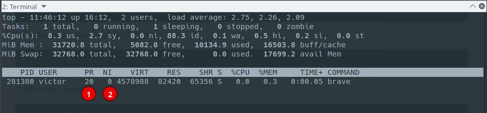

# 3.e Adjust process scheduling

## Process Priority vs Nice Value

_From `top`'s man page_

> **PR** -- Priority The scheduling priority of the task. If you see 'rt' in this field, it means the task is running under 'real time' scheduling priority.
>
> **NI** -- Nice Value The nice value of the task. A negative nice value means higher priority, whereas a positive nice value means lower priority. Zero in this field simply means priority will not be adjusted in determining a task's dispatch-ability

Every process requires a certain amount of system resources, such as CPU time and RAM, to be able to perform its tasks. Each process is assigned a process priority to determine how much CPU or processor time is allocated to it for execution.  

In addition to processes, in Linux, there are user processes. Linux allows us to set a level of 'niceness' (a nice value) on a per-user basis. Note that the nice value only controls how much CPU time each process is allocated, but not how much memory can be used or which I/O devices can be used. Bear in mind that the process priority may differ from the nice value. The nice value is how much priority the Linux kernel will grant to each named user, whereas the process priority is the actual priority of a running process.  

There are 140 possible process priorities; 0 to 99 for real time and 100 to 139 for users.

Nice values ranges from -20 (highest priority) to 19 (lowest priority), with 0 being the default priority.

In most cases PR value can be computed by the following formula: PR = 20 + NI. Thus the process with niceness 3 has the priority 23 (20 + 3) and the process with niceness -7 has the priority 13 (20 - 7).

**Remember**
+ There are 140 possible process priorities:
  + 0 to 99 for real time
  + 100 to 139 for users
+ Nice values:
  + Ranges from -20 (highest priority) to 19 (lowest priority)
  + 0 is the default priority
+ PR is calculated:
  + for normal processes: PR = 20 + NI (NI is nice and ranges from -20 to 19)  
  + for real time processes: PR = - 1 - real_time_priority (real_time_priority ranges from 1 to 99)

## Changing the Nice Value

### nice

Set the nice value before starting the process.

    # nice -n [#] [command]

### renice

`renice` allows you to change the nice value of a running process.

    # renice -n [#] -p [PID]

You can run 'renice' for multiple parameters. For example, the  following  command  would  change the priority of the processes with PIDs 987 and 32, plus all processes owned by the users daemon and root:

    # renice +1 987 -u daemon root -p 32

### top

You can also change the nice value of running processes with `top`.

+ `u` - Sort by user
+ `r` - Renice process

## The Linux Process Scheduler

The scheduler is the component of the kernel that selects which process to run next. The scheduler (or process scheduler, as it is sometimes called) can be viewed as the code that divides the finite resource of processor time between the runnable processes on a system. The scheduler is the basis of a multitasking operating system such as Linux. By deciding what process can run, the scheduler is responsible for best utilizing the system and giving the impression that multiple processes are simultaneously executing.

### Linux Process Scheduler Types

#### Real Time Schedulers

They implement the fixed-priority real-time scheduling specified by the POSIX standard. Tasks with these policies preempt every other task, which can thus easily go into starvation (if they don't release the CPU).

##### SCHED_FIFO (First In First Out)

Tasks running in SCHED_FIFO will never be preempted. They will leave the CPU only for waiting sync kernel events or if an explicit sleep or reschedule has been requested from user space.

SCHED_FIFO can be used only with static priorities higher than 0, which means that when a SCHED_FIFO thread becomes runnable, it will always immediately preempt any currently running SCHED_OTHER, SCHED_BATCH, or SCHED_IDLE thread

##### SCHED_RR (Round Robin)

SCHED_RR is a simple enhancement of SCHED_FIFO.  Everything described above for SCHED_FIFO also applies to SCHED_RR, except that each thread is allowed to run only for a maximum time quantum.

Tasks running in SCHED_RR are real time (RT), but they will leave the CPU if there is another real-time task in the run queue.

#### Non Real Time Schedulers

##### SCHED_DEADLINE (Sporadic task model deadline)

A sporadic task is one that has a sequence of jobs, where each job is activated at most once per period.  Each job also has a relative deadline, before which it should finish execution, and a computation time, which is the CPU time necessary for executing the job.  The moment when a task wakes up because a new job has to be executed is called the arrival time (also referred to as the request time or release time).  The start time is the time at which a task starts its execution.  The absolute deadline is thus obtained by adding the relative deadline to the arrival time.

##### SCHED_OTHER or SCHED_NORMAL (Default Linux time-sharing scheduling)

SCHED_OTHER tasks are the normal user tasks (default).  

SCHED_OTHER can be used at only static priority 0 (i.e., threads under real-time policies always have priority over SCHED_OTHER processes).  SCHED_OTHER is the standard Linux time-sharing scheduler that is intended for all threads that do not require the special real-time mechanisms.

##### SCHED_BATCH (Scheduling batch processes)

SCHED_BATCH can be used only at static priority 0.  This policy is similar to SCHED_OTHER in that it schedules the thread according to its dynamic priority (based  on the  nice value).  The difference is that this policy will cause the scheduler to always assume that the thread is CPU-intensive. Consequently, the scheduler will apply  a  small  scheduling penalty with respect to wakeup behavior, so that this thread is mildly disfavored in scheduling decisions.

This policy is useful for workloads that are noninteractive, but do not  want  to  lower  their nice value, and for workloads that want a deterministic scheduling policy without interactivity causing extra preemptions (between the workload's tasks).

##### SCHED_IDLE (Scheduling very low priority jobs)

SCHED_IDLE can be used only at static priority 0; the process nice value has no influence for this policy.

This  policy is intended for running jobs at extremely low priority (lower even than a +19 nice value with the SCHED_OTHER or SCHED_BATCH policies).

### Managing Scheduler  

#### Changing the Scheduler for Running Processes

**Commands:**
+ chrt (1)             - manipulate the real-time attributes of a process
+ sched (7)          - overview of CPU scheduling

**Options:**
- `-b` - Used to set policy to SCHED_BATCH
- `-d` - Used to set policy to SCHED_DEADLINE
- `-f` - Used to set policy to SCHED_FIFO
- `-i` - Used to set policy to SCHED_IDLE
- `-o` - Used to set policy to SCHED_OTHER
- `-r` - Used to set policy to SCHED_RR

Show priorities

    # chrt -m
    SCHED_OTHER min/max priority    : 0/0
    SCHED_FIFO min/max priority    : 1/99
    SCHED_RR min/max priority    : 1/99
    SCHED_BATCH min/max priority    : 0/0
    SCHED_IDLE min/max priority    : 0/0
    SCHED_DEADLINE min/max priority    : 0/0

View a process scheduler setting

    # chrt -p [PID]

    # chrt -p 1  
    pid 1's current scheduling policy: SCHED_OTHER
    pid 1's current scheduling priority: 0

    # chrt -p 39
    pid 39's current scheduling policy: SCHED_FIFO
    pid 39's current scheduling priority: 99

Change a process to use FIFO

    # chrt -f -p [priority] [PID]

Change a process to use RR

    # chrt -r -p [priority]  [PID]

Change back to other (needs to be set with priority 0. You can change the niceness after)

    # chrt -o -p 0 [PID]

##### Example

We will change the scheduler for the 'Brave' browser.

First we get the main PID for the process tree

    # pidof -s brave
    281380

We can check that the current priority is set to 'SCHED_OTHER'

    # chrt -p 281380
    pid 281380's current scheduling policy: SCHED_OTHER
    pid 281380's current scheduling priority: 0

And we can also use `top` to confirm the priority (1) and niceness (2) level

Let's change to round robin (SCHED_RR) with a priority 1

    # chrt -r -p 1 281380

Confirm the change

    # chrt -p 281380
    pid 281380's current scheduling policy: SCHED_RR
    pid 281380's current scheduling priority: 1

Check again with `top`

    top - 11:38:06 up 16:04,  2 users,  load average: 2.33, 2.21, 2.08
    Tasks: 420 total,   1 running, 419 sleeping,   0 stopped,   0 zombie
    %Cpu(s):  5.3 us,  2.0 sy,  0.0 ni, 92.2 id,  0.0 wa,  0.3 hi,  0.1 si,  0.0 st
    MiB Mem :  31720.8 total,   5071.1 free,  10282.7 used,  16367.0 buff/cache
    MiB Swap:  32768.0 total,  32768.0 free,      0.0 used.  17676.5 avail Mem

        PID USER      PR  NI    VIRT    RES    SHR S  %CPU  %MEM     TIME+ COMMAND                           
     281380 victor    -2   0 4578988  82420  65356 S   0.0   0.3   0:00.05 brave

Now let's change it to 'FIFO' with a priority of 99 (essentially making it real time, RT)

    # chrt -f -p 99 281380

Confirm the change

    # chrt -p 281380
    pid 281380's current scheduling policy: SCHED_FIFO
    pid 281380's current scheduling priority: 99

We can confirm once again with `top`. The priority is now set to 'rt'

    top - 11:42:04 up 16:08,  2 users,  load average: 1.96, 1.83, 1.94
    Tasks: 418 total,   3 running, 415 sleeping,   0 stopped,   0 zombie
    %Cpu(s):  7.0 us,  3.2 sy,  0.0 ni, 89.1 id,  0.1 wa,  0.4 hi,  0.2 si,  0.0 st
    MiB Mem :  31720.8 total,   5008.4 free,  10258.9 used,  16453.6 buff/cache
    MiB Swap:  32768.0 total,  32768.0 free,      0.0 used.  17614.3 avail Mem

        PID USER      PR  NI    VIRT    RES    SHR S  %CPU  %MEM     TIME+ COMMAND                           
     281380 victor    rt   0 4578988  82420  65356 S   0.0   0.3   0:00.05 brave

Let's change it back to 'SCHED_OTHER'

    # chrt -o -p 0 281380

And confirm

    # chrt -p 281380
    pid 281380's current scheduling policy: SCHED_OTHER
    pid 281380's current scheduling priority: 0

#### Starting a Process With a Different Scheduler

    # chrt -f [priority level] [command]

Making a process use the DEADLINE scheduler

    # chrt -d --sched-runtime [value] --sched-deadline [value] --sched-period [value] 0 [command]

The usual practice is to set Runtime to something bigger than the average computation time (or worst-case execution time for hard real-time tasks), Deadline to the relative deadline, and Period to the period of the task.

+ `-T`, `--sched-runtime` - Specifies runtime parameter
+ `-D`, `--sched-deadline` - Specifies deadline parameter
+ `-P`, `--sched-period` - Specifies period parameter

         arrival/wakeup                    absolute deadline
                |    start time                    |
                |        |                         |
                v        v                         v
           -----x--------xooooooooooooooooo--------x--------x---
                         |<-- Runtime ------->|
                |<----------- Deadline ----------->|
                |<-------------- Period ------------------->|

#### Setting scheduler priorities at boot (systemd)

[8 > Tuning Guide> Chapter 3. Realtime-specific tuning > 3.1.1. Changing the priority of service during boot process ](https://access.redhat.com/documentation/en-us/red_hat_enterprise_linux_for_real_time/8/html/tuning_guide/chap-realtime-specific_tuning#orde-Changing_The_Priority_Of_Service_During_Boot_Process)

You can use the parameters `CPUSchedulingPolicy=` and `CPUSchedulingPriority=` to change the scheduler of a service.  

    [SERVICE]
    CPUSchedulingPolicy=fifo
    CPUSchedulingPriority=20

**📌 EXAM TIP:** *If you can't remember the Systemd unit file options, you can use `man systemd.exec` and search for 'SCHEDULING'*

---
[⬅️ Back](3-Operate-running-systems.md)
