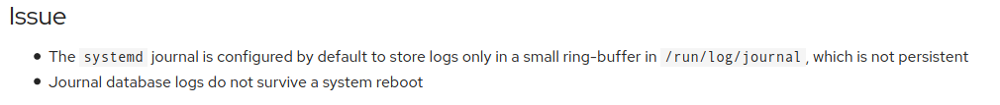

# 3.h Preserve system journals

Normally, 'journald' journals (for RHEL) don't persist through reboots ([RHEL KB](https://access.redhat.com/solutions/696893)). See below:

*From the man page for systemd-journald*

>The journal service stores log data either persistently below /var/log/journal or in a volatile way below /run/log/journal/ (in the latter case it is lost at reboot). By default, log data is stored persistently if /var/log/journal/ exists during boot, with an implicit fallback to volatile storage otherwise. Use Storage= in journald.conf(5) to configure where log data is placed, independently of the existence of /var/log/journal/.
>
> On systems where /var/log/journal/ does not exist yet but where persistent logging is desired (and the default journald.conf is used), it is sufficient to create the directory, and ensure it has the correct access modes and ownership:
>
> `mkdir -p /var/log/journal`
>
> `systemd-tmpfiles --create --prefix /var/log/journal`

You can confirm that persistent journals are not enabled by asking `journalctl` to list boots (there should be more than one if it's enabled):

    # journalctl --list-boots
     0 a677aaa6bdf1407a99dd7d1375d88be1 Sun 2020-12-13 03:54:03 EST—Sun 2020-12-13 12:25:17 EST

And by checking if the `/var/log/journal` folder exists

    # ll /var/log/journal
    ls: cannot access '/var/log/journal': No such file or directory

## Enabling Persistent Journals

### Option 1: From 'systemd-journald' man page

Create the required folder:

    # mkdir -p /var/log/journal

Create systemd temp files for '/var/log/journal'

    # systemd-tmpfiles --create --prefix /var/log/journal

Set a value for `SystemMaxUse=` in `/etc/systemd/journald.conf` (by default journalctl will use up to 10% of the folder mount point)

    # grep 'SystemMaxUse=' /etc/systemd/journald.conf
    SystemMaxUse=100M

Restart 'systemd' service

    # systemctl restart systemd-journald

Or if you want to keep your current logs, run

    # killall -USR1 systemd-journald

### Option 2: Red Hat's KB

[How to enable persistent logging for the systemd journal](https://access.redhat.com/solutions/696893)

Create the log folder

    # mkdir /var/log/journal

Edit `/etc/systemd/journald.conf` and change the value of `Storage` and `SystemMaxUse=`

    Storage=persistent
    SystemMaxUse=100M

Restart the service

    # systemctl restart systemd-journald

---

#### Additional Info

**Man Pages:**
- systemd-journald (8) - Journal service
- journalctl (1)       - Query the systemd journal
- journald.conf (5)    - Journal service configuration files

_man journald.conf_

       Storage=

           Controls where to store journal data. One of "volatile", "persistent", "auto"
            and "none". If "volatile", journal log data will be stored only in memory, i.e.
            below the /run/log/journal hierarchy (which is created if needed). If
            "persistent", data will be stored preferably on disk, i.e. below the
            /var/log/journal hierarchy (which is created if needed), with a fallback to
            /run/log/journal (which is created if needed), during early boot and if the
            disk is not writable.  "auto" is similar to "persistent" but the directory
            /var/log/journal is not created if needed, so that its existence controls where
            log data goes.  "none" turns off all storage, all log data received will be
            dropped. Forwarding to other targets, such as the console, the kernel log
            buffer, or a syslog socket will still work however. Defaults to "auto".

---
[⬅️ Back](3-Operate-running-systems.md)
