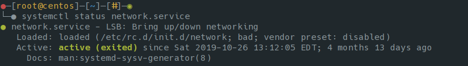

# 3.i Start, stop, and check the status of network services

**Network Services** - Any services that rely on the network to run

Important `systemctl` options
+ status
+ enable - Remember that it creates a symlink (`/etc/systemd/system/[target]/`)
+ disable
+ start
+ stop
+ mask
+ unmask
+ is-enabled

## Mask vs Disable

### Disable

Disabling the service deletes the symlink, so the unit file itself is not affected, but the service is not loaded at the next boot, when systemd reads `/etc/systemd/system`.

However, a disabled service can be loaded, and will be started if a service that depends on it is started; `enable` and `disable` only configure auto-start behaviour for units, and the state is easily overridden.

### Mask

A masked service is one whose unit file is a symlink to `/dev/null`. This makes it "impossible" to load the service, even if it is required by another, enabled service.

When you mask a service, a symlink is created from `/etc/systemd/system` to `/dev/null`, leaving the original unit file elsewhere untouched. When you unmask a service the symlink is deleted.

---
[⬅️ Back](3-Operate-running-systems.md)
