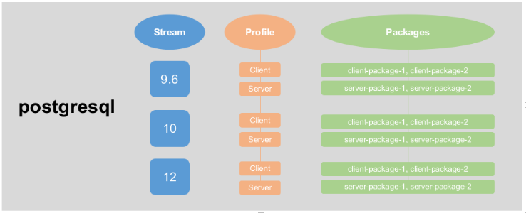

# 6.f Work with package module streams

## Definition

RHEL 8 content is distributed through two main repositories: BaseOS and AppStream.  

**BaseOS**

Content in the BaseOS repository is intended to provide the core set of the underlying OS functionality that provides the foundation for all installations. This content is available in the RPM format and is subject to support terms similar to those in previous releases of Red Hat Enterprise Linux.  

**AppStream**

Content in the AppStream repository includes additional user-space applications, runtime languages, and databases in support of the varied workloads and use cases. Content in AppStream is available in one of two formats - the familiar RPM format and an extension to the RPM format called modules.

Components made available as Application Streams can be packaged as modules or RPM packages and are delivered through the AppStream repository in Red Hat Enterprise Linux 8. Each AppStream component has a given life cycle.

### Modules

Modules allow you to install a specific version and/or type of an application in your system. For example, for 'postgresql' you can choose to install from multiple versions (stream), and client/server type (profile).

    # dnf module list postgresql
    Last metadata expiration check: 0:20:44 ago on Sat 14 Mar 2020 08:59:58 PM UTC.
    CentOS-8 - AppStream
    Name                     Stream              Profiles                        Summary
    postgresql               9.6                 client, server [d]              PostgreSQL server and client module
    postgresql               10 [d]              client, server [d]              PostgreSQL server and client module
    postgresql               12                  client, server                  PostgreSQL server and client module
    Hint: [d]efault, [e]nabled, [x]disabled, [i]nstalled

For httpd on Centos8, currently only one stream (version) is available, and profiles are the package type (common, minimal, development)

    # dnf module list httpd
    Last metadata expiration check: 0:21:46 ago on Sat 14 Mar 2020 08:59:58 PM UTC.
    CentOS-8 - AppStream
    Name                  Stream               Profiles                              Summary
    httpd                 2.4 [d][e]           common [d], devel, minimal            Apache HTTP Server
    Hint: [d]efault, [e]nabled, [x]disabled, [i]nstalled

## Working with Modules

### Getting Information on Modules

Listing all modules

    # dnf module list

Listing module summary for one module

    # dnf module list [module]

    # dnf module list httpd
    Last metadata expiration check: 0:21:46 ago on Sat 14 Mar 2020 08:59:58 PM UTC.
    CentOS-8 - AppStream
    Name                  Stream               Profiles                              Summary
    httpd                 2.4 [d][e]           common [d], devel, minimal            Apache HTTP Server

Listing info on a module  

    # dnf module info [module]

    # dnf module info httpd
    Last metadata expiration check: 0:35:45 ago on Sat 14 Mar 2020 08:59:58 PM UTC.
    Name             : httpd
    Stream           : 2.4 [d][e][a]
    Version          : 8010020191223202455
    Context          : cdc1202b
    Architecture     : x86_64
    Profiles         : common [d], devel, minimal
    Default profiles : common
    Repo             : AppStream
    Summary          : Apache HTTP Server
    Description      : Apache httpd is a powerful, efficient, and extensible HTTP server.
    Artifacts        : httpd-0:2.4.37-16.module_el8.1.0+256+ae790463.src
                     : httpd-0:2.4.37-16.module_el8.1.0+256+ae790463.x86_64
                     : httpd-debuginfo-0:2.4.37-16.module_el8.1.0+256+ae790463.x86_64
                     : httpd-debugsource-0:2.4.37-16.module_el8.1.0+256+ae790463.x86_64
                     : httpd-devel-0:2.4.37-16.module_el8.1.0+256+ae790463.x86_64
                     : httpd-filesystem-0:2.4.37-16.module_el8.1.0+256+ae790463.noarch
                     : httpd-manual-0:2.4.37-16.module_el8.1.0+256+ae790463.noarch
                     : httpd-tools-0:2.4.37-16.module_el8.1.0+256+ae790463.x86_64
                     : httpd-tools-debuginfo-0:2.4.37-16.module_el8.1.0+256+ae790463.x86_64
                     : mod_http2-0:1.11.3-3.module_el8.1.0+213+acce2796.src
                     : mod_http2-0:1.11.3-3.module_el8.1.0+213+acce2796.x86_64
                     : mod_http2-debuginfo-0:1.11.3-3.module_el8.1.0+213+acce2796.x86_64
                     : mod_http2-debugsource-0:1.11.3-3.module_el8.1.0+213+acce2796.x86_64
                     : mod_ldap-0:2.4.37-16.module_el8.1.0+256+ae790463.x86_64
                     : mod_ldap-debuginfo-0:2.4.37-16.module_el8.1.0+256+ae790463.x86_64
                     : mod_md-0:2.4.37-16.module_el8.1.0+256+ae790463.x86_64
                     : mod_md-debuginfo-0:2.4.37-16.module_el8.1.0+256+ae790463.x86_64
                     : mod_proxy_html-1:2.4.37-16.module_el8.1.0+256+ae790463.x86_64
                     : mod_proxy_html-debuginfo-1:2.4.37-16.module_el8.1.0+256+ae790463.x86_64
                     : mod_session-0:2.4.37-16.module_el8.1.0+256+ae790463.x86_64
                     : mod_session-debuginfo-0:2.4.37-16.module_el8.1.0+256+ae790463.x86_64
                     : mod_ssl-1:2.4.37-16.module_el8.1.0+256+ae790463.x86_64
                     : mod_ssl-debuginfo-1:2.4.37-16.module_el8.1.0+256+ae790463.x86_64

Listing profiles

    # dnf module info --profile [module]

    # dnf module info --profile httpd
    Last metadata expiration check: 0:36:28 ago on Sat 14 Mar 2020 08:59:58 PM UTC.
    Name    : httpd:2.4:8010020191223202455:cdc1202b:x86_64
    common  : httpd
            : httpd-filesystem
            : httpd-tools
            : mod_http2
            : mod_ssl
    devel   : httpd
            : httpd-devel
            : httpd-filesystem
            : httpd-tools
    minimal : httpd

You can also filter the information with '[module_name]:[stream]'

    # dnf module info --profile php:7.3

### Changing Stream and Profile

**⚠️ WARNING:** _Switching module streams will not alter installed packages. You will need to remove a package, reset the module stream and then install the new module stream for the package._  

#### Via 'module enable/disable'

Enable the stream for 'postgresql' v9.6

    # dnf module enable postgresql:9.6

Enable the httpd devel profile

    # dnf module enable --profile httpd:2.4/devel
    Last metadata expiration check: 0:47:51 ago on Sat 14 Mar 2020 08:59:58 PM UTC.
    Ignoring unnecessary profile: 'httpd/devel'
    Dependencies resolved.
    Nothing to do.
    Complete!

Then install the package

    # yum install postgresql httpd  

To change a module stream again, you will need to run `yum module reset [module name]`, and then enable the new module.  

    # yum module enable postgresql:10
    Last metadata expiration check: 0:06:07 ago on Sat 14 Mar 2020 09:57:50 PM UTC.
    Dependencies resolved.
    The operation would result in switching of module 'postgresql' stream '9.6' to stream '10'
    Error: It is not possible to switch enabled streams of a module.
    It is recommended to remove all installed content from the module, and reset the module using 'dnf module reset <module_name>' command. After you reset the module, you can install the other stream.

    # yum module reset postgresql
    Last metadata expiration check: 0:06:15 ago on Sat 14 Mar 2020 09:57:50 PM UTC.
    Dependencies resolved.
    =================================================================================================
    Package               Architecture         Version                  Repository             Size
    =================================================================================================
    Resetting modules:
    postgresql                                                                                      
    Transaction Summary
    =================================================================================================
    Is this ok [y/N]: y
    Complete!

#### Directly with `dnf module install`

Here we see that the stream is setup to use postgresql 10

    # dnf module list postgresql
    Updating Subscription Management repositories.
    Last metadata expiration check: 1:21:21 ago on Tue 24 Nov 2020 01:34:58 PM EST.
    Red Hat Enterprise Linux 8 for x86_64 - AppStream (RPMs)
    Name                Stream         Profiles                   Summary                                     
    postgresql          9.6            client, server [d]         PostgreSQL server and client module         
    postgresql          10 [d]         client, server [d]         PostgreSQL server and client module         
    postgresql          12             client, server [d]         PostgreSQL server and client module         
    Hint: [d]efault, [e]nabled, [x]disabled, [i]nstalled

Install another version with 'dnf module install'

    # dnf module install postgresql:9.6
    Updating Subscription Management repositories.
    Last metadata expiration check: 1:22:00 ago on Tue 24 Nov 2020 01:34:58 PM EST.
    Dependencies resolved.
    =========================================================================================================
    Package            Arch    Version                              Repository                         Size
    =========================================================================================================
    Installing group/module packages:
    postgresql-server  x86_64  9.6.10-1.module+el8+2470+d1bafa0e    rhel-8-for-x86_64-appstream-rpms  5.0 M
    Installing dependencies:
    libpq              x86_64  12.4-1.el8_2                         rhel-8-for-x86_64-appstream-rpms  195 k
    postgresql         x86_64  9.6.10-1.module+el8+2470+d1bafa0e    rhel-8-for-x86_64-appstream-rpms  1.4 M
    Installing module profiles:
    postgresql/server                                                                                       
    Enabling module streams:
    postgresql                 9.6                                                                          
    Transaction Summary
    =========================================================================================================
    Install  3 Packages
    Total download size: 6.6 M
    Installed size: 27 M
    Is this ok [y/N]: y
    Downloading Packages:
    (1/3): libpq-12.4-1.el8_2.x86_64.rpm                                     502 kB/s | 195 kB     00:00     
    (2/3): postgresql-9.6.10-1.module+el8+2470+d1bafa0e.x86_64.rpm           1.0 MB/s | 1.4 MB     00:01     
    (3/3): postgresql-server-9.6.10-1.module+el8+2470+d1bafa0e.x86_64.rpm    2.5 MB/s | 5.0 MB     00:02     
    ---------------------------------------------------------------------------------------------------------
    Total                                                                    3.2 MB/s | 6.6 MB     00:02      
    Running transaction check
    Transaction check succeeded.
    Running transaction test
    Transaction test succeeded.
    Running transaction
      Preparing        :                                                                                 1/1  
      Installing       : libpq-12.4-1.el8_2.x86_64                                                       1/3  
      Installing       : postgresql-9.6.10-1.module+el8+2470+d1bafa0e.x86_64                             2/3  
      Running scriptlet: postgresql-server-9.6.10-1.module+el8+2470+d1bafa0e.x86_64                      3/3  
      Installing       : postgresql-server-9.6.10-1.module+el8+2470+d1bafa0e.x86_64                      3/3  
      Running scriptlet: postgresql-server-9.6.10-1.module+el8+2470+d1bafa0e.x86_64                      3/3  
      Verifying        : postgresql-9.6.10-1.module+el8+2470+d1bafa0e.x86_64                             1/3  
      Verifying        : postgresql-server-9.6.10-1.module+el8+2470+d1bafa0e.x86_64                      2/3  
      Verifying        : libpq-12.4-1.el8_2.x86_64                                                       3/3  
    Installed products updated.
    Installed:
      libpq-12.4-1.el8_2.x86_64                                                                               
      postgresql-9.6.10-1.module+el8+2470+d1bafa0e.x86_64                                                     
      postgresql-server-9.6.10-1.module+el8+2470+d1bafa0e.x86_64                                              
    Complete!

You can see now that the stream for 9.6 is enabled

    # dnf module list postgresql
    Updating Subscription Management repositories.
    Last metadata expiration check: 1:25:13 ago on Tue 24 Nov 2020 01:34:58 PM EST.
    Red Hat Enterprise Linux 8 for x86_64 - AppStream (RPMs)
    Name              Stream         Profiles                      Summary                                    
    postgresql        9.6 [e]        client, server [d] [i]        PostgreSQL server and client module        
    postgresql        10 [d]         client, server [d]            PostgreSQL server and client module        
    postgresql        12             client, server [d]            PostgreSQL server and client module        
    Hint: [d]efault, [e]nabled, [x]disabled, [i]nstalled

If you try to install another stream it will error out

    # dnf module install postgresql:10
    Updating Subscription Management repositories.
    Last metadata expiration check: 1:25:55 ago on Tue 24 Nov 2020 01:34:58 PM EST.
    Dependencies resolved.
    The operation would result in switching of module 'postgresql' stream '9.6' to stream '10'
    Error: It is not possible to switch enabled streams of a module.
    It is recommended to remove all installed content from the module, and reset the module using 'dnf module reset <module_name>' command. After you reset the module, you can install the other stream.

Uninstall the package

    # dnf module remove -y postgresql
    Updating Subscription Management repositories.
    Last metadata expiration check: 1:31:35 ago on Tue 24 Nov 2020 01:34:58 PM EST.
    Dependencies resolved.
    =========================================================================================================
    Package            Arch    Version                             Repository                          Size
    =========================================================================================================
    Removing:
    postgresql-server  x86_64  9.6.10-1.module+el8+2470+d1bafa0e   @rhel-8-for-x86_64-appstream-rpms   21 M
    Removing unused dependencies:
    libpq              x86_64  12.4-1.el8_2                        @rhel-8-for-x86_64-appstream-rpms  719 k
    postgresql         x86_64  9.6.10-1.module+el8+2470+d1bafa0e   @rhel-8-for-x86_64-appstream-rpms  5.2 M
    Disabling module profiles:
    postgresql/server                                                                                       
    Transaction Summary
    =========================================================================================================
    Remove  3 Packages
    Freed space: 27 M
    Running transaction check
    Transaction check succeeded.
    Running transaction test
    Transaction test succeeded.
    Running transaction
      Preparing        :                                                                                 1/1  
      Running scriptlet: postgresql-server-9.6.10-1.module+el8+2470+d1bafa0e.x86_64                      1/1  
      Running scriptlet: postgresql-server-9.6.10-1.module+el8+2470+d1bafa0e.x86_64                      1/3  
      Erasing          : postgresql-server-9.6.10-1.module+el8+2470+d1bafa0e.x86_64                      1/3  
      Running scriptlet: postgresql-server-9.6.10-1.module+el8+2470+d1bafa0e.x86_64                      1/3  
      Erasing          : postgresql-9.6.10-1.module+el8+2470+d1bafa0e.x86_64                             2/3  
      Erasing          : libpq-12.4-1.el8_2.x86_64                                                       3/3  
      Running scriptlet: libpq-12.4-1.el8_2.x86_64                                                       3/3  
      Verifying        : libpq-12.4-1.el8_2.x86_64                                                       1/3  
      Verifying        : postgresql-9.6.10-1.module+el8+2470+d1bafa0e.x86_64                             2/3  
      Verifying        : postgresql-server-9.6.10-1.module+el8+2470+d1bafa0e.x86_64                      3/3  
    Installed products updated.
    Removed:
      libpq-12.4-1.el8_2.x86_64                                                                               
      postgresql-9.6.10-1.module+el8+2470+d1bafa0e.x86_64                                                     
      postgresql-server-9.6.10-1.module+el8+2470+d1bafa0e.x86_64                                              
    Complete!

Reset the module

    # dnf module reset -y postgresql
    Updating Subscription Management repositories.
    Last metadata expiration check: 1:27:18 ago on Tue 24 Nov 2020 01:34:58 PM EST.
    Dependencies resolved.
    =========================================================================================================
    Package                 Architecture           Version                    Repository               Size
    =========================================================================================================
    Disabling module profiles:
    postgresql/server                                                                                       
    Resetting modules:
    postgresql                                                                                              
    Transaction Summary
    =========================================================================================================
    Complete!

Install the new module stream for the package

    # dnf module install -y postgresql
    Updating Subscription Management repositories.
    Last metadata expiration check: 1:33:29 ago on Tue 24 Nov 2020 01:34:58 PM EST.
    Dependencies resolved.
    =========================================================================================================
    Package           Arch   Version                                 Repository                        Size
    =========================================================================================================
    Installing group/module packages:
    postgresql-server x86_64 10.14-1.module+el8.2.0+7801+be0fed80    rhel-8-for-x86_64-appstream-rpms 5.0 M
    Installing dependencies:
    libpq             x86_64 12.4-1.el8_2                            rhel-8-for-x86_64-appstream-rpms 195 k
    postgresql        x86_64 10.14-1.module+el8.2.0+7801+be0fed80    rhel-8-for-x86_64-appstream-rpms 1.5 M
    Installing module profiles:
    postgresql/server                                                                                       
    Enabling module streams:
    postgresql               10                                                                             
    Transaction Summary
    =========================================================================================================
    Install  3 Packages
    Total download size: 6.7 M
    Installed size: 26 M
    Downloading Packages:
    (1/3): postgresql-10.14-1.module+el8.2.0+7801+be0fed80.x86_64.rpm        2.5 MB/s | 1.5 MB     00:00     
    (2/3): libpq-12.4-1.el8_2.x86_64.rpm                                     291 kB/s | 195 kB     00:00     
    (3/3): postgresql-server-10.14-1.module+el8.2.0+7801+be0fed80.x86_64.rpm 6.3 MB/s | 5.0 MB     00:00     
    ---------------------------------------------------------------------------------------------------------
    Total                                                                    8.3 MB/s | 6.7 MB     00:00      
    Running transaction check
    Transaction check succeeded.
    Running transaction test
    Transaction test succeeded.
    Running transaction
      Preparing        :                                                                                 1/1  
      Installing       : libpq-12.4-1.el8_2.x86_64                                                       1/3  
      Installing       : postgresql-10.14-1.module+el8.2.0+7801+be0fed80.x86_64                          2/3  
      Running scriptlet: postgresql-server-10.14-1.module+el8.2.0+7801+be0fed80.x86_64                   3/3  
      Installing       : postgresql-server-10.14-1.module+el8.2.0+7801+be0fed80.x86_64                   3/3  
      Running scriptlet: postgresql-server-10.14-1.module+el8.2.0+7801+be0fed80.x86_64                   3/3  
      Verifying        : postgresql-10.14-1.module+el8.2.0+7801+be0fed80.x86_64                          1/3  
      Verifying        : postgresql-server-10.14-1.module+el8.2.0+7801+be0fed80.x86_64                   2/3  
      Verifying        : libpq-12.4-1.el8_2.x86_64                                                       3/3  
    Installed products updated.
    Installed:
      libpq-12.4-1.el8_2.x86_64                                                                               
      postgresql-10.14-1.module+el8.2.0+7801+be0fed80.x86_64                                                  
      postgresql-server-10.14-1.module+el8.2.0+7801+be0fed80.x86_64                                           
    Complete!

---
[⬅️ Back](6-deploy-configure-and-maintain-systems.md)
