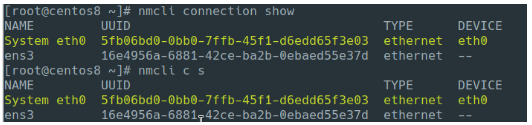

# 7.a Configure IPv4 and IPv6 addresses

**📌 EXAM TIPs**

- Check if `bash-completion` is installed. If it's not, install it
- Use `man nmcli-examples` to get usage examples

## Nmcli - NetworkManager Command Line Interface  

nmcli is a command-line tool for controlling NetworkManager and reporting network status. Connections are added under the default location '/etc/sysconfig/network-scripts'.

Nmcli allows you to use shorthand for the commands:

### Notes About Making changes

#### Connection Changes

After making changes to a connection (adding IP, removing IP, adding DNS, etc.), you will need to restart the connection (or NetworkManager) for the changes to take effect. There are a few ways you can do that.

Restart the connectio with `ifup` and `ifdown`

    # ifdown [conn-name] ; ifup [conn-name]

Restart the connection with `nmcli`

    # nmcli connection down [conn-name] ; nmcli connection up [conn-name]

You can also restart NetworkManager, however this will restart all connections

    # systemctl restart NetworkManager

#### Adding Removing Connections

Adding removing connections will apply the changes in real-time.

When removing a connection, if another connection is configured with `autoconnect yes` for the same interface, it will come up as soon as the connection is deleted.

#### `ip4` vs `ipv4`

when creating a new connection it's ok to use `ip4`. However, when modifying existing connections you might want to use `ipv4.addresses` (depending on your goal).

    Table 25. IPv4 options
    ┌──────┬────────────────┬────────────────────────┐
    │Alias │ Property       │ Note                   │
    ├──────┼────────────────┼────────────────────────┤
    │ip4   │ ipv4.addresses │ The alias is           │
    │      │ ipv4.method    │ equivalent to the      │
    │      │                │ +ipv4.addresses syntax │
    │      │                │ and also sets          │
    │      │                │ ipv4.method to manual. │
    │      │                │ It can be specified    │
    │      │                │ multiple times.        │
    ├──────┼────────────────┼────────────────────────┤

### Viewing Connections

Showing a detailed summary for all connections  

    # nmcli  
    enp0s3: connected to enp0s3
            "Intel 82540EM"
            ethernet (e1000), 08:00:27:88:D9:41, hw, mtu 1500
            ip4 default
            inet4 10.0.2.15/24
            route4 0.0.0.0/0
            route4 10.0.2.0/24
            inet6 fe80::8ae2:af6:2a08:da9f/64
            route6 fe80::/64
            route6 ff00::/8
    virbr0: connected (externally) to virbr0
            "virbr0"
            bridge, 52:54:00:23:91:BD, sw, mtu 1500
            inet4 192.168.122.1/24
            route4 192.168.122.0/24
    enp0s8: disconnected
            "Intel 82540EM"
            1 connection available
            ethernet (e1000), 08:00:27:13:B0:B4, hw, mtu 1500
    lo: unmanaged
            "lo"
            loopback (unknown), 00:00:00:00:00:00, sw, mtu 65536
    virbr0-nic: unmanaged
            "virbr0-nic"
            tun, 52:54:00:23:91:BD, sw, mtu 1500
    DNS configuration:
            servers: 10.13.15.1
            domains: localdomain
            interface: enp0s3
    Use "nmcli device show" to get complete information about known devices and
    "nmcli connection show" to get an overview on active connection profiles.
    Consult nmcli(1) and nmcli-examples(7) manual pages for complete usage details.

Show connections  

    # nmcli connection show
    NAME                UUID                                  TYPE      DEVICE  
    enp0s3              705f36b0-b830-41bd-9c6e-f6fa9172f5b4  ethernet  enp0s3  
    Wired connection 1  573da91e-f3a4-3022-8d8a-f50724cba81b  ethernet  enp0s8  
    virbr0              67335241-6637-4453-8bd1-14b5513c5178  bridge    virbr0  

Show only active

    # nmcli con show --active
    NAME         UUID                                  TYPE      DEVICE  
    System eth0  5fb06bd0-0bb0-7ffb-45f1-d6edd65f3e03  ethernet  eth0  

Show device status

    # nmcli device status  
    DEVICE      TYPE      STATE                   CONNECTION          
    enp0s3      ethernet  connected               enp0s3              
    enp0s8      ethernet  connected               Wired connection 1  
    virbr0      bridge    connected (externally)  virbr0              
    lo          loopback  unmanaged               --                  
    virbr0-nic  tun       unmanaged               --   

Show information for device

    # nmcli device show enp0s8  
    GENERAL.DEVICE:                         enp0s8
    GENERAL.TYPE:                           ethernet
    GENERAL.HWADDR:                         08:00:27:13:B0:B4
    GENERAL.MTU:                            1500
    GENERAL.STATE:                          100 (connected)
    GENERAL.CONNECTION:                     eth1
    GENERAL.CON-PATH:                       /org/freedesktop/NetworkManager/ActiveConnection/7
    WIRED-PROPERTIES.CARRIER:               on
    IP4.ADDRESS[1]:                         10.0.2.3/24
    IP4.ADDRESS[2]:                         10.0.3.15/24
    IP4.GATEWAY:                            --
    IP4.ROUTE[1]:                           dst = 10.0.2.0/24, nh = 0.0.0.0, mt = 101
    IP4.ROUTE[2]:                           dst = 10.0.3.0/24, nh = 0.0.0.0, mt = 101
    IP4.DNS[1]:                             10.13.15.1
    IP4.DNS[2]:                             8.8.8.8
    IP4.DOMAIN[1]:                          localdomain
    IP6.ADDRESS[1]:                         fe80::c67a:fc98:efeb:4501/64
    IP6.GATEWAY:                            --
    IP6.ROUTE[1]:                           dst = fe80::/64, nh = ::, mt = 101
    IP6.ROUTE[2]:                           dst = ff00::/8, nh = ::, mt = 256, table=255

### Adding New Connections

A connection is "active" when a device uses that connection's configuration to create or connect to a network. There may be multiple connections that apply to a device, but only one of them can be active on that device at any given time. The additional connections can be used to allow quick switching between different networks and configurations.

DHCP

    # nmcli con add con-name [connection name] method auto type ethernet ifname eth1

Static IP

    # nmcli con add con-name [connection name] type ethernet ifname eth1 ip4 10.0.0.2 gw4 10.0.0.1

Static IP with DNS

    # nmcli connection add con-name [connection name] type ethernet ifname eth1 ip4 10.0.2.3/24 gw4 10.0.2.2 ipv4.dns 8.8.8.8

**Common options:**
- autoconnect - Connection comes up automatically at boot
- method
  - auto - DHCP asigned
  - manual - static IP
  - disabled - connection is disabled
  - shared - connection sharing
- type - ethernet, wifi, bluetooth, vlan, tun, dummy, etc...
- ifname - Interface that will be used for activation

      # cat /etc/sysconfig/network-scripts/ifcfg-eth1
      TYPE=Ethernet
      PROXY_METHOD=none
      BROWSER_ONLY=no
      BOOTPROTO=dhcp
      IPADDR=10.0.2.3
      PREFIX=24
      DNS1=8.8.8.8
      DEFROUTE=no
      IPV4_FAILURE_FATAL=yes
      IPV6INIT=yes
      IPV6_AUTOCONF=yes
      IPV6_DEFROUTE=yes
      IPV6_FAILURE_FATAL=no
      IPV6_ADDR_GEN_MODE=stable-privacy
      NAME=eth1
      UUID=42995f47-e0b1-4c81-aa22-7662cba404c7
      DEVICE=enp0s8
      ONBOOT=yes

### Modify Connection

Change the default IP

    # nmcli connection modify eth1 ipv4.addresses 10.0.2.5/24

Add a secondary IP

    # nmcli connection modify eth1 +ipv4.addresses 10.0.2.4/24

Delete secondary IP for connection

    # nmcli connection modify eth1 -ipv4.addresses 10.0.2.4

Restart the interface

    # nmcli connection down eth1 && nmcli connection up eth1  
    Connection 'eth1' successfully deactivated (D-Bus active path: /org/freedesktop/NetworkManager/ActiveConnection/2)
    Connection successfully activated (D-Bus active path: /org/freedesktop/NetworkManager/ActiveConnection/4)

### Enable/Disable Connections

To bring up connections

    # nmcli con up [connection name]

To take down connection

    # nmcli connection down eth1
    Connection 'eth1' successfully deactivated (D-Bus active path: /org/freedesktop/NetworkManager/ActiveConnection/7)

### Deleting Connections

Delete "Wired connection 1"

    # nmcli connection delete "Wired connection 1"
    Connection 'Wired connection 1' (573da91e-f3a4-3022-8d8a-f50724cba81b) successfully deleted.

### Adding IPv6 Connections

You can use an IPv4 address as part of an IPv6 address to make it easier to understand things

    # nmcli connection modify enp0s8 ip6 ::fff:10.0.2.3/64 ipv6.gateway ::fff:10.0.2.2

### nmcli interactive connection editor

With the 'edit' option, nmcli presents you with a iteractive editor. The interactive editor will guide you through the connection editing and allow you to change connection parameters according to your needs by means of a simple menu-driven interface.

    # nmcli connection edit eth1

    ===| nmcli interactive connection editor |===

    Editing existing '802-3-ethernet' connection: 'eth1'

    Type 'help' or '?' for available commands.
    Type 'print' to show all the connection properties.
    Type 'describe [<setting>.<prop>]' for detailed property description.

    You may edit the following settings: connection, 802-3-ethernet (ethernet), 802-1x, dcb, sriov, ethtool, match, ipv4, ipv6, tc, proxy
    nmcli>  

Configure the IP

    nmcli> set ipv4.addresses  
    Enter 'addresses' value: 10.0.2.4/24

Configure default route

    nmcli> set ipv4.gateway 10.0.2.2

Configure DNS

    nmcli> set ipv4.dns 8.8.8.8

Check that it's working, save and quit

    nmcli> verify
    Verify connection: OK

    nmcli> save
    Connection 'eth1' (42995f47-e0b1-4c81-aa22-7662cba404c7) successfully updated.

    nmcli> quit

## Nmtui - NetworkManager Text Based User Interface

nmtui is a curses‐based TUI application for interacting with NetworkManager.

### Adding a connection

## IP Command

The 'ip' command will also accept shorthand
Changes are not persistent

**Common used commands:**
- ip addr - Shows addresses assigned to all network interfaces.
- ip neigh - Shows the current neighbour table in kernel (ARP table).
- ip link set x up - Bring up interface x.
- ip link set x down - Bring down interface x.
- ip route - Show table routes.

Adding a new IP

    # ip addr add 10.0.0.2 dev eth0

Deleting the IP

    # ip addr del 10.0.0.2/32 dev eth0

---

#### Additional Info:

[Configure IPv4 addresses and perform basic IPv4 troubleshooting](https://www.certdepot.net/rhel7-configure-ipv4-addresses/)

---
[⬅️ Back](7-manage-basic-networking.md)
